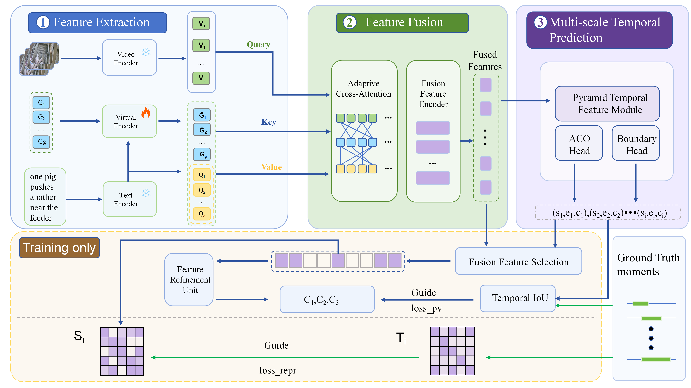

# PigBDMR: Text-to-Video Multi-Moment Retrieval via Adaptive Virtual Token Alignment for Pig Behavior Analysis in Surveillance Videos

[](LICENSE)
[](requirements.txt)

**:star: If PigBDMR is helpful to your project, please consider starring this repository. Thanks!**

## TABLE OF CONTENTS

- [PigBDMR: Text-to-Video Multi-Moment Retrieval via Adaptive Virtual Token Alignment for Pig Behavior Analysis in Surveillance Videos](#pigbdmr-text-to-video-multi-moment-retrieval-via-adaptive-virtual-token-alignment-for-pig-behavior-analysis-in-surveillance-videos)
  - [TABLE OF CONTENTS](#table-of-contents)
  - [1. Introduction](#1-introduction)
  - [2. Preparation](#2-preparation)
    - [2.1 Requirements](#21-requirements)
    - [2.2 Data, Features, and Checkpoints](#22-data-features-and-checkpoints)
  - [3. Run](#3-run)
    - [3.1 Train](#31-train)
    - [3.2 Evaluation](#32-evaluation)
  - [4. Expected Performance](#4-expected-performance)
  - [5. References](#5-references)
  - [6. Acknowledgements](#6-acknowledgements)
  - [7. Contact](#7-contact)

## 1. Introduction

This repository contains the implementation of **PigBDMR**, the codebase for:

> **Text-to-Video Multi-Moment Retrieval via Adaptive Virtual Token Alignment for Pig Behavior Analysis in Surveillance Videos**  



PigBDMR targets behavior queries in long pig-pen videos and retrieves one or more relevant temporal moments. It is designed for welfare-relevant and health-indicative behaviors, including aggressive/harmful interactions, feeding, drinking, resting/lying, locomotion/standing, excretion, and exploratory/social behaviors.

The key components include:

- A dense multi-moment retrieval pipeline for pig behavior videos.
- Behavior-oriented evaluation on welfare-critical and health-indicative queries.
- A **Virtual Encoder** mechanism implemented through learnable virtual tokens.
- A standalone temporal moment retrieval evaluator for reproducing test-set metrics.

The framework follows the paper structure and consists of four main stages:

1. **Feature Extraction**: video and text encoders extract visual behavior features and language query representations.
2. **Feature Fusion**: adaptive cross-attention aligns video tokens, query tokens, and Virtual Encoder tokens; a fusion feature encoder further refines text-conditioned video features.
3. **Multi-scale Temporal Prediction**: a pyramid temporal feature module, ACO head, and boundary head predict multiple behavior moments.
4. **Post-Verification Module**: training-only temporal IoU guidance and representation refinement improve proposal quality without adding the main inference-time reranking cost by default.

This public release includes source code, evaluation utilities, configuration files, and public test annotations. Training annotations, extracted features, model checkpoints, generated reports, and logs are not stored in Git.

## 2. Preparation

```bash
git clone <repository-url>
cd PigBDMR
```

### 2.1 Requirements

The reference environment uses Python 3.12.

```bash
conda create -n pigbdmr python=3.12 -y
conda activate pigbdmr
pip install -r requirements.txt
```


### 2.2 Data, Features, and Checkpoints

The PigMMR Baidu Netdisk package provides the public test annotations, video mapping file, and pre-extracted features:

[PigMMR data link](https://pan.baidu.com/s/1nb4DeaZHwt0ie0kQ5_F0FQ)

The downloaded directory is organized as follows:

```text
PigMMR/
  ├── data/
  │   ├── test.jsonl
  │   └── video_chunks.csv
  └── features/
      ├── pig_slowfast_features/
      ├── pig_clip_features/
      └── pig_text_features/
```

The Baidu Netdisk package and this Git repository do not include training annotations. To train PigBDMR, prepare your own training JSONL file with the same schema and pass it with `--train_path`.

Each annotation record follows the moment retrieval format:

```json
{
  "qid": 114,
  "query": "A pig eats from the feeder.",
  "duration": 149.769,
  "vid": "multi_0007",
  "relevant_windows": [[0.0, 15.089], [25.925, 74.082]],
  "relevant_clip_ids": [0, 1, 2],
  "saliency_scores": [[4, 4, 4]]
}
```


The default feature settings are:

- SlowFast + CLIP visual features: `--v_feat_dim 2816`
- CLIP text features: `--t_feat_dim 512`

See `data/README.md`, `features/README.md`, and `checkpoints/README.md` for details.

## 3. Run

### 3.1 Train

Training requires user-prepared training annotations and extracted features. The public repository does not include the training JSONL file.

```bash
python PigBDMR/train.py data/MR.py \
  --exp_id pigbdmr_train \
  --use_neg --dset_name hl --ctx_mode video_tef \
  --train_path /path/to/train.jsonl \
  --eval_path /path/to/test.jsonl \
  --v_feat_dirs features/pig_slowfast_features features/pig_clip_features \
  --v_feat_dim 2816 \
  --t_feat_dir features/pig_text_features \
  --t_feat_dim 512 \
  --max_v_l 75 --max_q_l 40 --max_windows 5 \
  --bsz 64 --n_epoch 150 --eval_bsz 1 --eval_epoch 3 \
  --use_SRM --use_pv_repr \
  --kernel_size 5 --num_conv_layers 1 --num_mlp_layers 5 \
  --t2v_layers 6 --num_virtual_tokens 40 \
  --lw_reg 1.0 --lw_cls 5.0 --lw_saliency 0.8 \
  --lw_pv 9.0 --lw_pv1 0.7
```

`--num_virtual_tokens` controls the number of Virtual Encoder tokens. 

### 3.2 Evaluation

To recompute temporal moment retrieval metrics for a prediction file:

```bash
python standalone_eval/eval.py \
  --submission_path results/<exp>/hl_val_epoch_<N>_submission_nms_thd_0.7.jsonl \
  --gt_path /path/to/test.jsonl \
  --save_path results/<exp>/metrics.json
```

The prediction file should contain one JSON object per query:

```json
{
  "qid": 114,
  "query": "A pig eats from the feeder.",
  "vid": "multi_0007",
  "pred_relevant_windows": [[22.0, 76.0, 0.8905], [0.0, 14.0, 0.7536]]
}
```

## 4. Expected Performance

The following values summarize the expected PigBDMR performance on the released test setting. Feature files are available from the Baidu Netdisk package above; checkpoints are not stored in Git.

| Model | G-mAP | 1-tgt | 2-tgt | 3+tgt | mIoU@1 | mR@1 | Short G-mAP | Middle G-mAP | Long G-mAP |
|---|---:|---:|---:|---:|---:|---:|---:|---:|---:|
| PigBDMR | 35.22 | 40.07 | 27.79 | 16.54 | 50.08 | 42.51 | 5.51 | 29.06 | 52.02 |

PigBDMR can also be evaluated by behavior category, including aggressive/harmful behavior, feeding, drinking, resting/lying, locomotion/standing, excretion, and exploratory/social behavior. Generated reports and experiment-specific analysis artifacts are not tracked by Git.

## 5. References

If you find this repository useful or use PigBDMR in your work, please consider citing the associated paper. A formal BibTeX entry will be updated after publication.

```bibtex
@article{pigbdmr2026,
  title = {Text-to-Video Multi-Moment Retrieval via Adaptive Virtual Token Alignment for Pig Behavior Analysis in Surveillance Videos},
  year = {2026}
}
```

## 6. Acknowledgements

PigBDMR uses standard temporal moment retrieval training and evaluation protocols. We thank the open-source video moment retrieval community for releasing useful codebases and evaluation tools.

## 7. Contact

If you have any question, please raise an issue in this repository.

## License

This project is released under the Apache License 2.0. See `LICENSE`.
